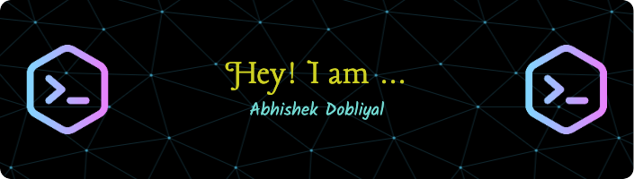

<h2 style="color: red;"> Hey There! I am Abhishek Dobliyal   </h2> 


 
[](https://www.linkedin.com/in/abhishek-dobliyal-4474061b7)
[](https://github.com/Abhishek-Dobliyal)


<h2 align="center">Trophies </h2>
<div align="center">
 
</div>
<h2 align="center">Technology Stack  </h2>

<h3 align="center"> Languages:
 
 
 
 
</h3>

<h3 align="center">Frameworks:
 
 
  
  
 
  
  
 
 
 
 </h3>
 
<h3 align="center">Additional:
 
 
 
 
 
</h3>

<h2 align="center">GitHub Analytics </h2>
<p align="center">
<a href="https://github.com/Abhishek-Dobliyal">
  
  
</a>
</p>

<p align = "center">

</p> 
<p align = "center">
 
</p> 

##  A little more about me... 

```go
package main

import (
    "fmt"
    lucian "graphicera.com/Abhishek-Dobliyal"
)

type About struct {
    lucian.AbhishekDobliyal
    Languages map[string][]string
    Tools map[string][]string
    Additional []string
}

func (a *lucian.AbhishekDobliyal) StayHappy(enjoy bool) {
    if enjoy {
        fmt.Println("Stay happy and keep coding!")
    } else {
        fmt.Println("Stay focused and keep coding!")
    }
}

func NewAbout() *About {
    return &About{
    
        Languages: map[string][]string{
            "Advanced": []string{"Python"},
            
            "Intermediate": []string{"GoLang", "Javascript", "SQL"},
            
            "Novice": []string{"C++", "Java"},
        },
        
        Tools: map[string][]string{
            "Machine Learning": []string{"Sklearn", "Pandas", "Numpy", 
                                         "Matplotlib", "Seaborn", "Tensorflow", 
                                         "Keras"},
                                                          
            "Web Related": []string{"Flask", "BeautifulSoup", "Streamlit", "VueJS", 
                                    "FastAPI", "Fiber", "TailwindCSS", "Bootstrap"},
                                    
            "GUIs/Automation": []string{"Tkinter", "Pygame", "PyAutoGUI"},
        },
        
        Additional: []string{"MySQL", "MongoDB", "HTML", "CSS", "Git/Github", 
                             "Data Structures and Algorithms", 
                             "Full Stack Development"},
    }
}

func main() {
    abhishekDobliyal := NewAbout()
    abhishekDobliyal.StayHappy(true)

    fmt.Println(abhishekDobliyal.Languages)
    fmt.Println(abhishekDobliyal.Tools)
    fmt.Println(abhishekDobliyal.Additional)

    fmt.Println("Thank You for visiting my Repo.")
}

```
